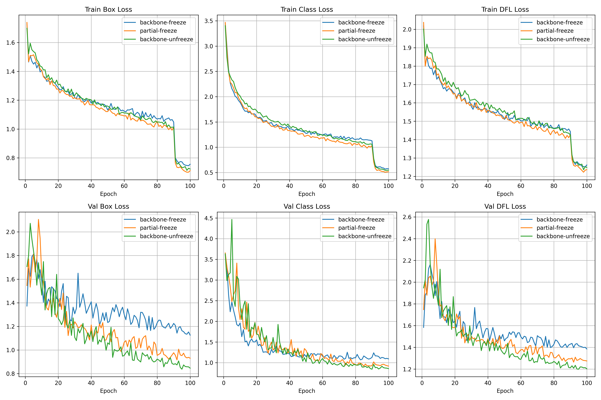
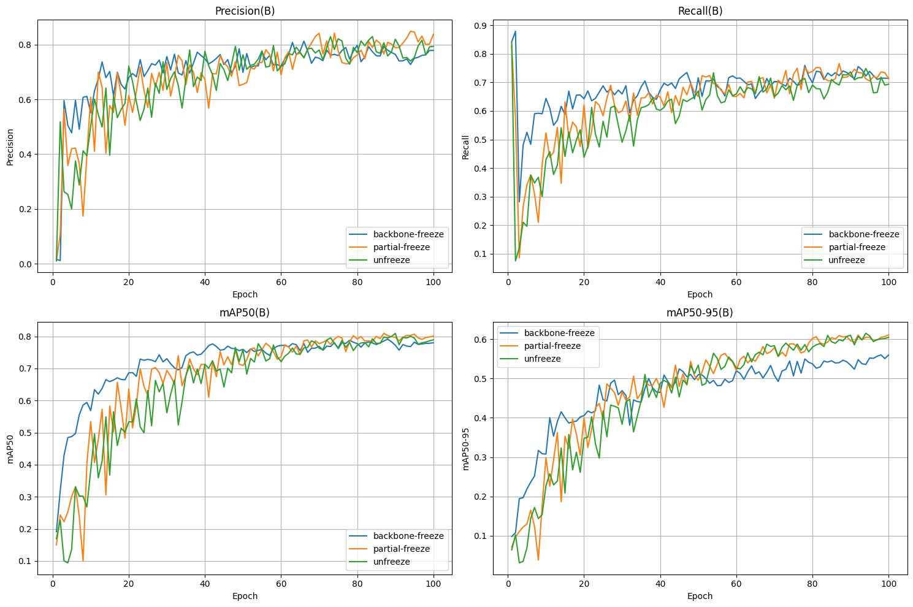

# Recyclable Waste Detection: Object Detection using YOLO11n


## 📌 Abstract

This repository contains the official implementation of the research project: **Implementation of a Transfer Learning-Based YOLO11n Model for Recyclable Waste Detection**.
We utilize the YOLO11n architecture with transfer learning to detect **Recyclable and Organic Waste** in **Real World Environment**. This project aims to **improve automated recyclable waste detection** by implementing a **YOLO11n model with transfer learning and evaluating layer-freezing strategies** to achieve an optimal balance between detection accuracy and computational efficiency.

## 🏗️ Model Architecture

We employ **YOLO11n (Nano)** due to its balance between inference speed and accuracy, suitable for edge devices.

- **Pre-trained Weights:** COCO dataset
- **Transfer Learning:** Fine-tuned on a custom dataset of 2.462 images
- **Modifications:** Standard Architecture

## 📂 Dataset

This project uses the publicly available **Recycle Trash Computer Vision Dataset** dataset.

- **Source:** [**Recycle Trash Computer Vision Dataset**](https://universe.roboflow.com/serba-serbi-labelling/recycle-trash-tlwso/dataset/3)
- **Classes:** `metal`, `plastic`, `paper`, `cardboard`, `glass`, `organic`
- **Structure:**
  - Train: 1970 images
  - Val: 247 images
  - Test: 245 images

> **Note:** The dataset is not hosted in this repository. You can download it from the source above or this driect link: https://drive.google.com/uc?export=download&id=1vzL5B7pgcb0xirGkoW7Uf0swyAgvuANn

## ⚙️ Training Scenarios

This project applies the Transfer Learning approach to the YOLO11n architecture to overcome dataset limitations and accelerate model convergence. The experiment is designed to evaluate the impact of _layer freezing_ on the model's feature extraction capabilities for recyclable waste objects. The scenarios are:

- Scenario 1 is **_Full Backbone Freezing_**, where the first 10 layers (backbone) of the YOLO11 architecture were frozen,
- Scenario 2 is **_Partial Backbone Freezing_**, where the first-half (first 5 layers) of the YOLO11 backbone were frozen, and
- Scenario 3 is **_Full Transfer Learning_**, where the whole backbone of YOLO11 were left unfrozen.

## 🏆 Performance Results

The model was trained for **100** epochs. Below are the evaluation metrics achieved on the test set:
| Scenario | Precision (P) | Recall (R) | mAP50 | mAP50-95 |
| :--- | :---: | :---: | :---: | :---: |
| Full Backbone Freezing | 0.797 | 0.684 | 0.785 | 0.565 |
| **Partial Backbone Freezing** | **0.823** | **0.767** | **0.84** | **0.657** |
| Full Transfer Learning | 0.813 | 0.716 | 0.815 | 0.624 |

## Training Visualizations

**<Big>Loss:</Big>**

**<Big>Metrics:</Big>**<br>


<hr>

## ⚙️ Installation

To run inference locally using the pre-trained model:

1. **Clone the repository:**

   ```bash
   git clone https://github.com/Tikusu/yolo11n-recyle-waste-detection
   cd yolo11n-recyle-waste-detection
   ```

2. **Create a virtual environment:**

   ```bash
   python -m venv your_venv_name
   source your_venv_name/Scripts/activate  # On MacOS/Linux: source your_venv_name\bin\activate
   ```

3. **Install dependencies:**
   ```bash
   pip install -r requirements.txt
   ```

## 🚀 Quick Start: Inference

You can test the model immediately using the provided script.

- **Run on a single image:**

  ```bash
  python src/inference.py --model model/yolo11n_backbone_freeze_best.pt --source sample/img/plastic.jpg
  ```

- **Run on a directory of images:**

  ```bash
  python src/inference.py --model model/yolo11n_backbone_freeze_best.pt --source sample/img/
  ```

- **Run on a video:**
  ```bash
  python src/inference.py --model model/yolo11n_backbone_freeze_best.pt --source sample/vid/inference_sample.mp4
  ```

\*_You can change the paths accordingly, these are the defaults._

## 📜 Citation

If you use this code for your research, please cite:

```BibTeX
@article{Inkiriwang_Tinambunan_2026,
    title={IMPLEMENTASI MODEL YOLO11n BERBASIS TRANSFER LEARNING UNTUK DETEKSI SAMPAH DAUR ULANG},
    volume={11},
    url={https://jurnal.univrab.ac.id/index.php/rabit/article/view/7323},
    DOI={10.36341/rabit.v11i1.7323},
    abstractNote={&amp;lt;p&amp;gt;&amp;lt;em&amp;gt;Recyclable waste management in Indonesia is often hindered by the inefficiency of manual sorting and lack of public awareness. This study aims to implement the YOLO11n model based on transfer learning to detect six types of recyclable waste and analyze the effect of layer freezing strategies on model accuracy and efficiency. An experimental method was employed utilizing the Recycle Trash Dataset of 2,462 images divided into three training scenarios: Full Transfer Learning, Partial Backbone Freezing (5 layers), and Full Backbone Freezing (10 layers). The results indicated that the Partial Backbone Freezing strategy delivered the best performance with an mAP50 of 0.840 and Precision of 0.823, showing statistical significance (p<0.05). The model demonstrated superior performance on the Metal class (mAP50 0.970) but faced significant challenges with the Organic class (Recall 0.496) due to high shape variation and the Plastic class due to material transparency. Testing on Raspberry Pi 5 showed an average inference time of 261 ms with a model size of 5.9 MB. In conclusion, the Partial Backbone Freezing technique applied to YOLO11n has proven to be the most effective in balancing generic feature extraction and semantic adaptation, making it suitable for implementation on resource-constrained edge devices.},
    number={1},
    journal={Rabit : Jurnal Teknologi dan Sistem Informasi Univrab},
    author={Inkiriwang, Valent Tio and Tinambunan, Medi Hermanto},
    year={2026},
    month={Jan.},
    pages={1298–1313}
}
```

[](https://jurnal.univrab.ac.id/index.php/rabit/article/view/7323/2882)

## 📄 License

This project is licensed under the **MIT License**.
